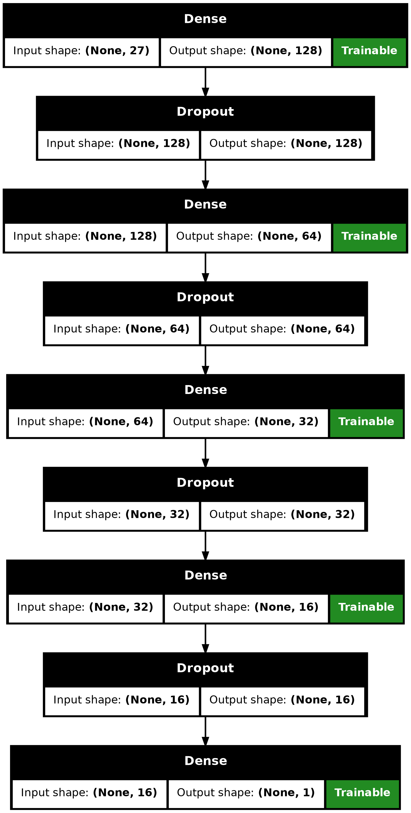
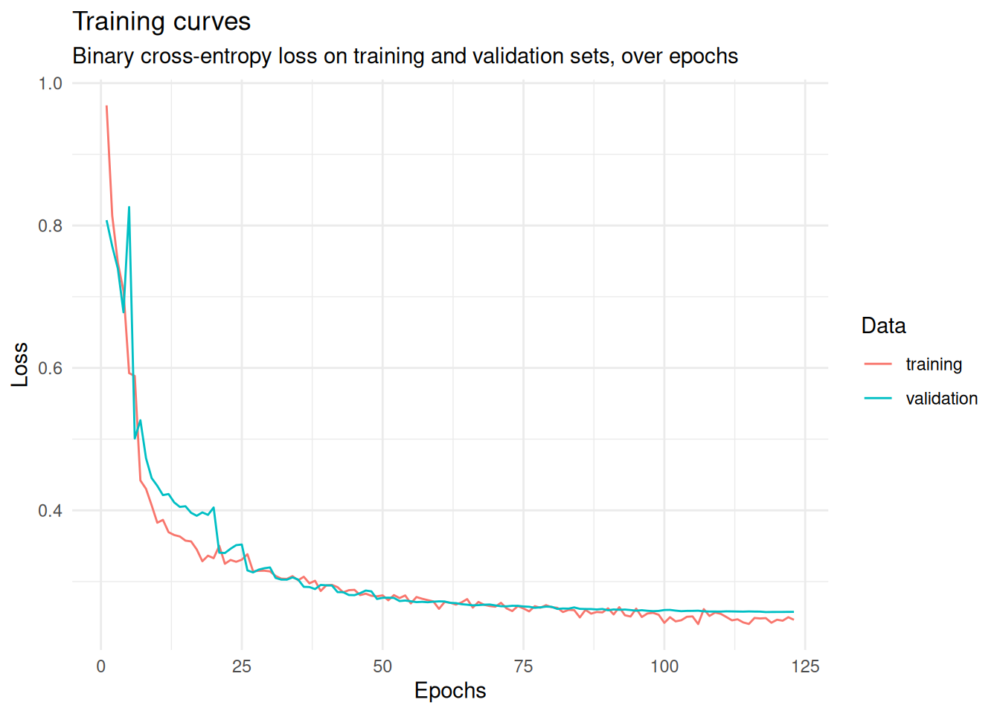
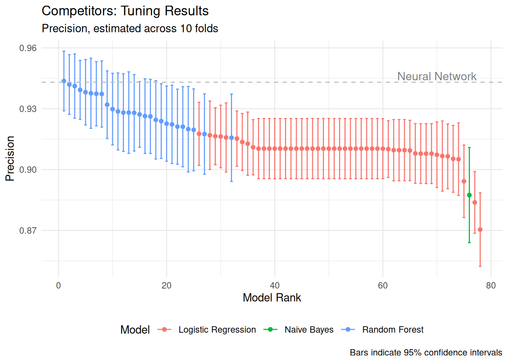
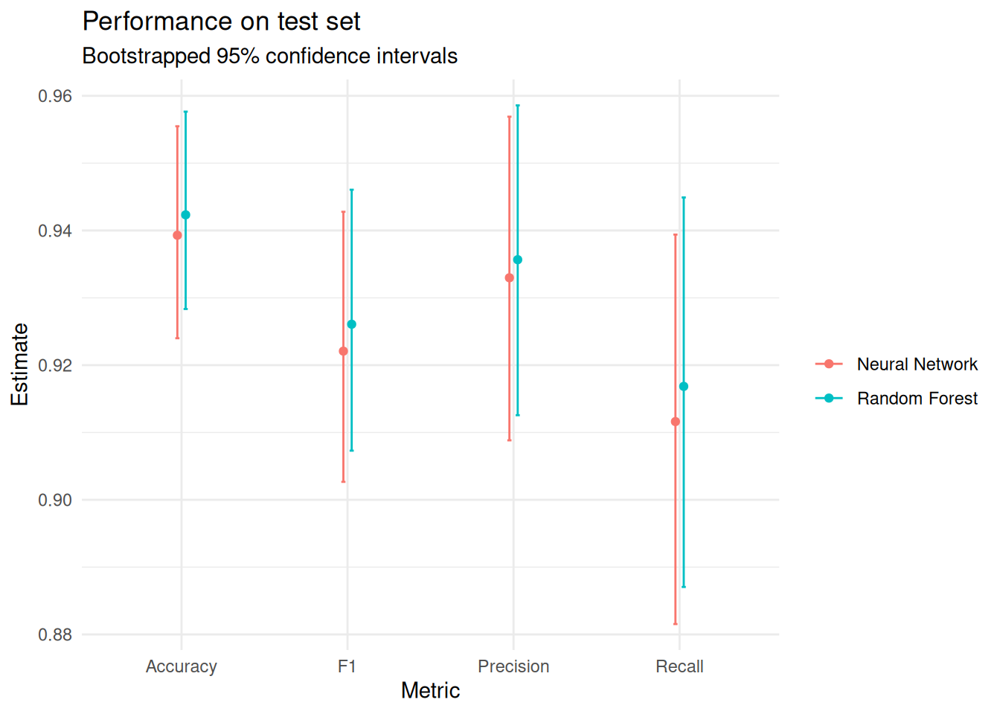
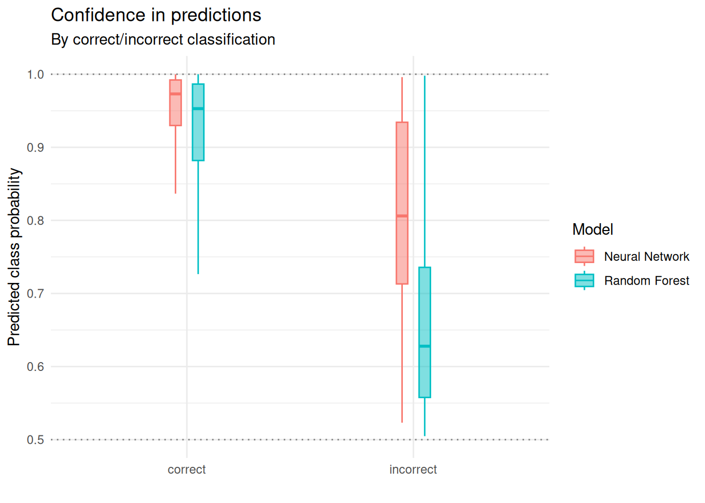
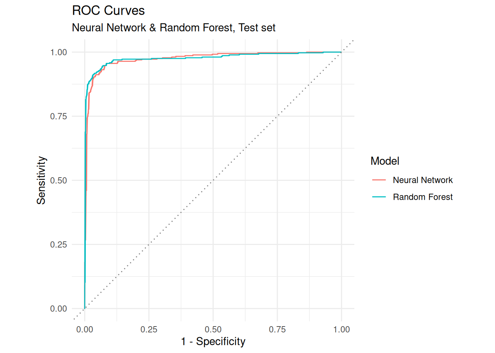

# Spam Detection

Building a neural network to classify emails as spam, as well as "traditional" competitor models. Models are built in `R/models.qmd`. The rendered notebook is also attached as HTML.

## Neural Network

Sequential model (multilayer perceptron) built with keras/tensorflow. Key facts: Adam optimizer, weight decay (L2-regularization), learning rate scheduling, early stopping. This is the architecture:

    

## Benchmark against traditional models

### Test metrics & performance

| Model | Precision | Accuracy | F1 |
|-------|-----------|----------|----|
| Neural Network | 0.932 | 0.939 | 0.922 |
| Random Forest | **0.935** | **0.942** | **0.926** |

