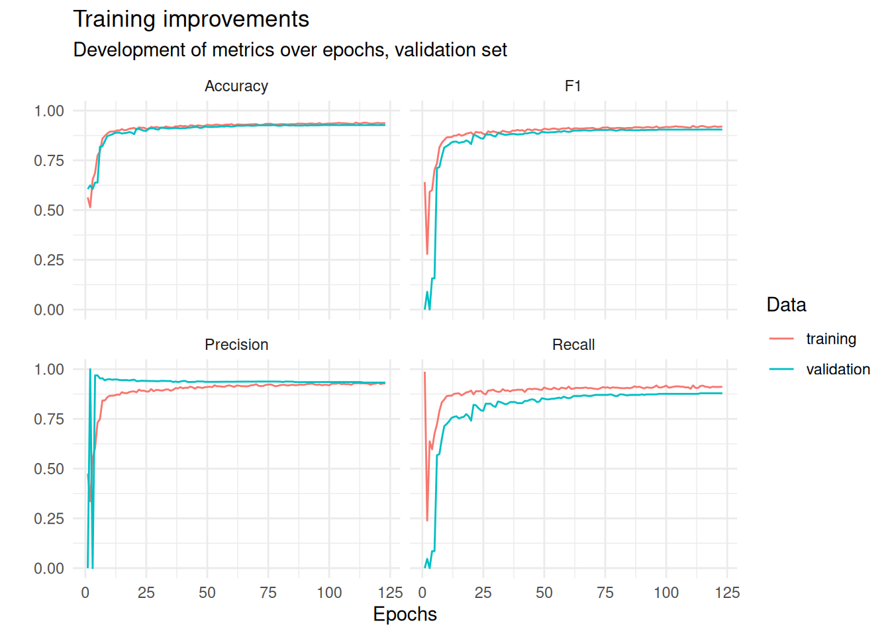

# Spam Detection

Building a neural network to classify emails as spam, as well as "traditional" competitor models. Models are built in `R/models.qmd`. The rendered notebook is also attached as HTML.


## Neural Network

Sequential model (multilayer perceptron) built with keras/tensorflow. Key facts: Adam optimizer, weight decay (L2-regularization), learning rate scheduling, early stopping. This is the architecture:
```r
mlp <- keras_model_sequential(
  layers = list(
    layer_dense(units = 16, activation = "relu", kernel_regularizer = regularizer_l2(0.01)),
    layer_dropout(rate = 0.25),
    layer_dense(units = 32, activation = "relu", kernel_regularizer = regularizer_l2(0.01)),
    layer_dropout(rate = 0.25),
    layer_dense(units = 16, activation = "relu", kernel_regularizer = regularizer_l2(0.01)),
    layer_dense(units = 1, activation = "sigmoid")
  )
)
```




